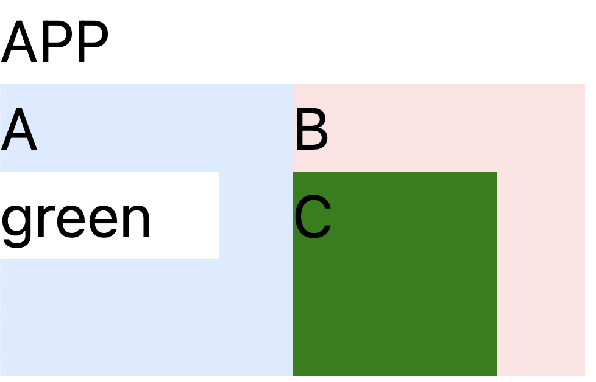
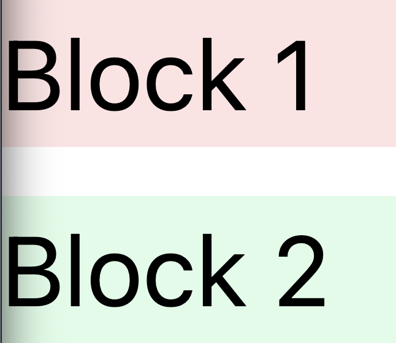
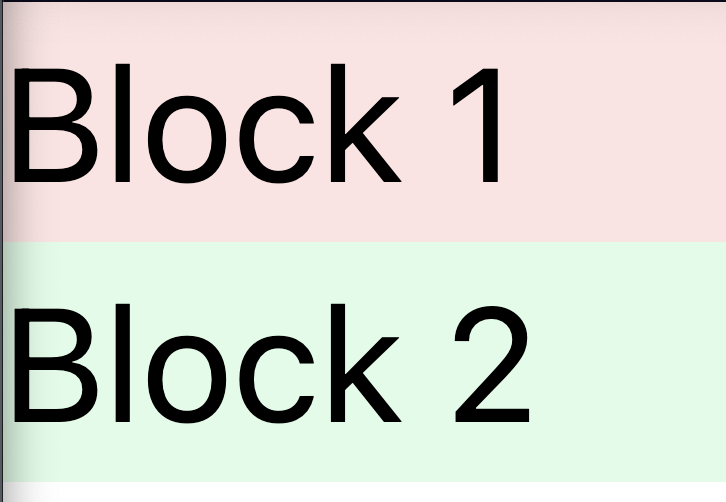
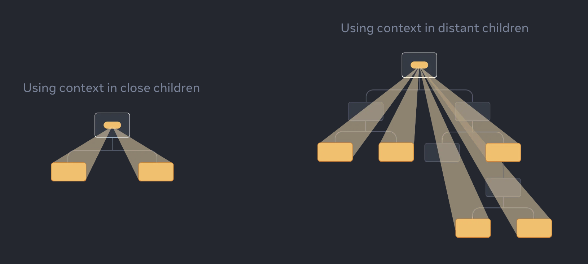

---
# default, gaia, uncover
theme: default
class:
  - lead
---


# React Features

<https://github.com/mmf-web/react-features/tree/main>

BSU @ 2024

---



# Задача

Изменяя инпут внутри A, нужно менять фон в C

---

```jsx
export default function App() {
  return (
    <> {/* 👈 Fragment */}
      <p>APP</p>
      <div className="flex"> {/* 👈 tailwind */}
        <A />
        <B />
      </div>
    </>
  )
}
```


---

# React.Fragment

`<Fragment> (<>...</>)`

<https://react.dev/reference/react/Fragment>

---



```js
export default function App() {
  return (
    <div className="flex">
      <div>Block 1</div>
      <div>Block 2</div>
    </div>
  )
}
```

---



```js
export default function App() {
  return (
    <div className="flex flex-col gap-2">
      <Blocks />
    </div>
  )
}

function Blocks() {
  return (
    <div>
      <div className="bg-red-100">Block 1</div>
      <div className="bg-green-100">Block 2</div>
    </div>
  )
}
```

---


```js
export default function App() {
  return (
    <div className="flex flex-col gap-2">
      <Blocks />
    </div>
  )
}

function Blocks() {
  return (
    <>
      <div className="bg-red-100">Block 1</div>
      <div className="bg-green-100">Block 2</div>
    </>
  )
}
```

---

```jsx
function A() {
  const [bg, setBg] = useState('green')
  return (
    <div className="aspect-square w-20 bg-blue-100">
      <p>A</p>
      <input
        className="w-3/4"
        type="text"
        value={bg}
        onChange={(e) => setBg(e.target.value)}
      />
    </div>
  )
}
```

---

```jsx
function B() {
  return (
    <div className="aspect-square w-20 bg-red-100">
      <p>B</p>
      <C />
    </div>
  )
}
```

---

```jsx
function C() {
  return (
    <div
      style={{ backgroundColor: 'green' }}
      className="aspect-square w-14"
    >
      <p>C</p>
    </div>
  )
}
```

---


# \#1 Грубая сила

Попередаём все везде...

---

## 1. Вынести состояние в App

```jsx
export default function App() {
  const [bg, setBg] = useState('green') 👈
  return (
    <div>
      <p>APP</p>
      <div className="flex">
        <A bg={bg} onChangeBg={setBg} /> 👈
        <B bg={bg} /> 👈
      </div>
    </div>
  )
}

```

---

## 2. Передать все props в A

```jsx
function A({ bg, onChangeBg }) { 👈
  return (
    <div className="aspect-square w-20 bg-blue-100">
      <p>A</p>
      <input
        className="w-3/4"
        type="text"
        value={bg} 👈
        onChange={(e) => onChangeBg(e.target.value)} 👈
      />
    </div>
  )
}
```

---

## 3. Передать все props в B

```jsx
function B({ bg }) { 👈
  return (
    <div className="aspect-square w-20 bg-red-100">
      <p>B</p>
      <C bg={bg} /> 👈
    </div>
  )
}
```

---

## 4. Передать все props в C

```jsx
function C({ bg }) { 👈
  return (
    <div
      style={{ backgroundColor: bg }} 👈
      className="aspect-square w-14"
    >
      <p>C</p>
    </div>
  )
}
```

---

# 🤓 Demo

---

# \#2 Комопонента как prop

Давайте передадим компоненту С внутрь B!

---

## 1. Придумаем prop

```jsx
export default function App() {
  const [bg, setBg] = useState('green')
  return (
    <div>
      <p>APP</p>
      <div className="flex">
        <A bg={bg} onChangeBg={setBg} />
        <B content={<C bg={bg} />} /> 👈
      </div>
    </div>
  )
}
```

---

## 2. Обновим B

```jsx
function B({ content }) { 👈
  return (
    <div className="aspect-square w-20 bg-red-100">
      <p>B</p>
      { content } 👈
    </div>
  )
}
```

---

# 🤓 Demo

---

# \#3 Children

<https://react.dev/learn/passing-props-to-a-component#passing-jsx-as-children>

---

```jsx
export default function App() {
  const [bg, setBg] = useState('green')
  return (
    <div>
      <p>APP</p>
      <div className="flex">
        <A bg={bg} onChangeBg={setBg} />
        <B>
          <C bg={bg} /> 👈
        </B>
      </div>
    </div>
  )
}
```

---

```jsx
function B({ children }) { 👈
  return (
    <div className="aspect-square w-20 bg-red-100">
      <p>B</p>
      { children } 👈
    </div>
  )
}
```

---

# 🤓 Demo

---

# \#4 React Context

<https://react.dev/learn/passing-data-deeply-with-context>

---

<https://react.dev/learn/passing-data-deeply-with-context>



---

```jsx
const SomeContext = createContext(defaultValue)

function A() {
  const [state, setState] = useState(defaultValue)
  return (
    <SomeContext.Provider value={state}>
      <B />
    </SomeContext.Provider>
  )
}

function B() {
  const contextValue = useContext(SomeContext)
  return <div>{contextValue}</div>
}
```

---

## 1. Создадим контекст и обернем все внутри APP

```jsx
const BgContext = createContext('green') 👈

export default function App() {
  const [bg, setBg] = useState('green') 👈
  return (
    <BgContext.Provider value={bg}> 👈
      <p>APP</p>
      <div className="flex">
        <A onChangeBg={setBg} />
        <B />
      </div>
    </BgContext.Provider>
  )
}
```

---

## 2. Используем его в C

```jsx
function C() {
  const bg = useContext(BgContext) 👈
  return (
    <div
      style={{ backgroundColor: bg }} 👈
      className="aspect-square w-14"
    >
      <p>C</p>
    </div>
  )
}
```

---

# 🤓 Demo

---

# Подходы

1. Грубая сила 💪
2. Компонента как prop
3. Children
4. Context

---

## 1. Грубая сила 💪

\+

- Всем очевидно, что происходит
- Не надо думать, надо просто сделать
- Не меняем структуру

\-

- Нужен психолог
- Много изменений, легко ошибиться

---

## 2. Компонента как prop

```jsx
<B content={<C bg={bg} />} />
```

\+

- Меньше кода

\-

- Меняем структуру (не всегда минус)
- Изменения в `C` рендерят `B` (нужен `useMemo`)
- Надо помнить, что в `B` нужно передать `C`

---

## 3. Children

```js
<B>
  <C bg={bg} />
</B>
```

\+

- Изменения в `C` **НЕ** рендерят `B`

\-

- Меняем структуру (не всегда минус)
- Надо помнить, что в `B` нужно передать `C`

---

## 4. Context

```js
createContext, useContext, context.Provider
```

\+

- Минимальные изменения **существующего** кода
- Не меняем структуру
- Можно использовать контекст где угодно

\-

- **неявно** (где и кто создает и меняет этот контекст?!)
- не всегда хорошо для библиотек

---

# Выводы

- Любите себя (нет грубой силе)
* Нет идеальных решений
* Не стоит изменять то, что работает, просто так
